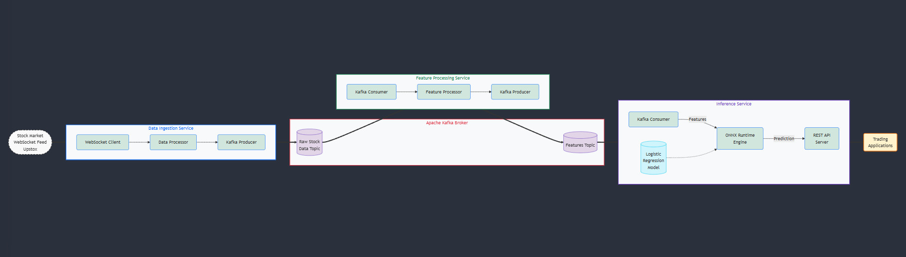

### Overview
This project implements a real-time stock prediction system using a microservices architecture. The system processes live TATA Motors stock data, computes relevant features, and generates buy/sell probability predictions via a REST API.
The architecture consists of three core microservices, each handling a distinct responsibility in the data pipeline:

- **Data Ingestion Service:** Consumes real-time stock data via WebSockets and publishes to Kafka.

- **Feature Processing Service:** Transforms raw stock data into features for model input.

- **Inference Service:** Applies a logistic regression model to predict buy/sell probabilities and serves those predictions via API.

### Architecture

### Microservices

### Data Ingestion Service
The data ingestion service establishes a WebSocket connection to [Upstox](https://upstox.com/developer/api-documentation/websocket) for streaming real-time stock data, specifically for TATA Motors. It processes incoming data, performs input sanitization and produces them to a Kafka topic.

**Key components**

- WebSocket client for real-time data consumption
- Automatic re-authorize to fetch [fresh access token](https://upstox.com/developer/api-documentation/access-token-request#authorization-expiry)
- Protocol Buffer based message serialization/ deserialization
- Kafka producer for reliable message publishing
- Configuration for WebSocket and Kafka borker

#### Feature Processing Service
This service consumes raw stock data from Kafka, calculates technical indicators and other trading features, and produces feature vectors to another Kafka topic.

**Key components**

- Kafka consumer for raw data consumption
- Feature computation for [windowed data stream](https://github/RajeshRk18/real-time-prediction-system/blob/main/feature_processing/src/processor.rs#L11)
- Kafka producer for publishing calculated features

#### Inference Service
The inference service consumes feature vectors from Kafka, runs them through a pre-trained logistic regression model (exported in ONNX format), and serves predictions through a REST API.

**Key components**

- Kafka consumer for feature consumption
- ONNX runtime for model inference
- REST API server for exposing predictions
